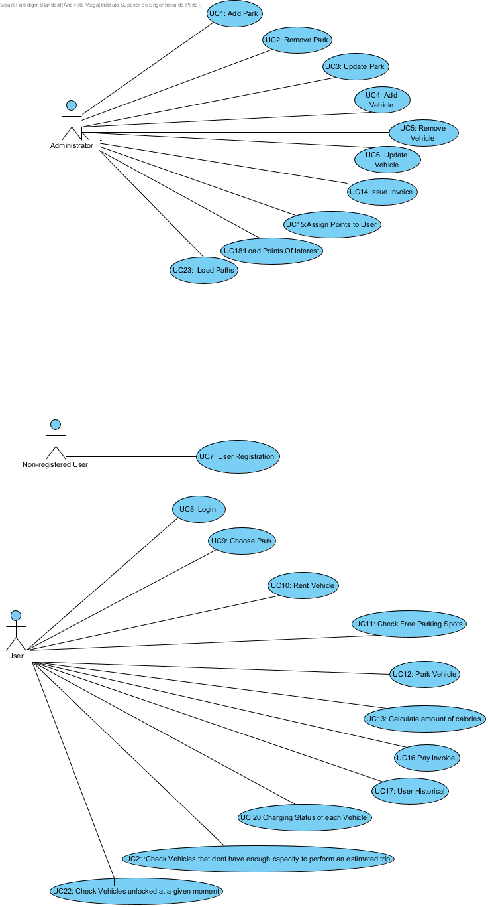

# Use Case Diagram

# Use Cases
| UC  | Description:                                                              |
|:----|:------------------------------------------------------------------------|
| UC1 | [AddParkIntoSystem](UseCases/UC1_AddParkIntoSystem.md) |
| UC2 | [Remove Park](UseCases/UC2_RemovePark.md) |
| UC3 | [Update Park](UseCases/UC3_UpdatePark.md) |
| UC4 | [Add Vehicle](UseCases/UC4_AddVehicle.md) |
| UC5 | [Remove Vehicle](UseCases/UC5_RemoveVehicle.md) |
| UC6 | [Update Vehicle](UseCases/UC6_UpdateVehicle.md) |
| UC7 | [User Registration](UseCases/UC7_UserRegistration.md) |
| UC8 | [Login](UseCases/UC8_Login.md) |
| UC9 | [Choose Park](UseCases/UC9_ChoosePark.md)|
| UC10 | [Rental](UseCases/UC10_Rental.md) |
| UC11 | [Check Free Parking Spots](UseCases/UC11_CheckFreeParkingSpots.md)|
| UC12 | [Park Vehicle](UseCases/UC12_ParkVehicle.md)|
| UC13 | [Calculate Amount of Calories](UseCases/UC13_CalculateAmountCalories.md)|
| UC14 | [Issue Invoice](UseCases/UC14_IssueInvoice.md)  |
| UC16  |[Pay Invoice](UseCases/UC16_PayInvoice.md)    |
| UC17 | [User Historical](UseCases/UC17_UserHistorical.md)   |
| UC18 | [Add Point of Interest](UseCases/UC18_AddPOI.md) |
| UC20 | [Charging Status Of Each Vehicle](UseCases/UC20_ChargingStatusOfEachVehicle.md)|
| UC21| [Check if Vehicle has Capacity To Perform Estimated Trip](UseCases/UC21_estimatedTrip.md)|
| UC22 | [Check Vehicles unlocked](UseCases/UC22_CheckVehiclesUnlocked.md)  |
| UC23 | [Add Path](UseCases/UC23_AddPath.md)  |
